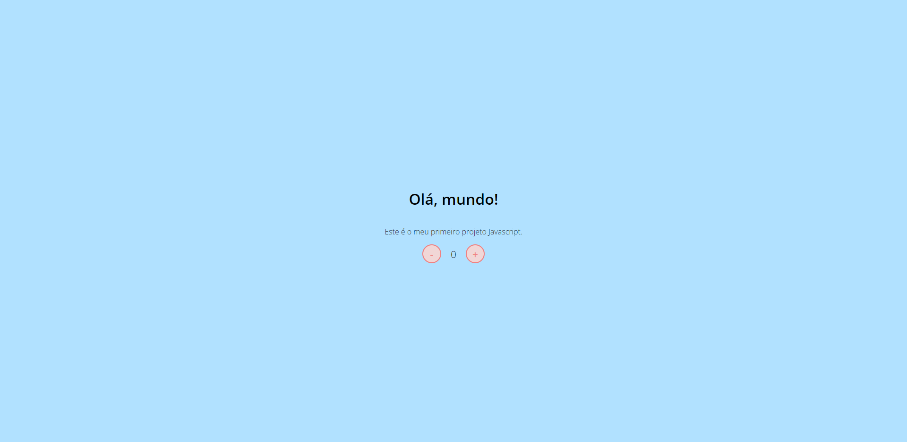

<h1 align="center"> Dio Teste JavaScript </h1>

Projeto desenvolvido através dos vídeos de ensinamentos básicos do JavaScript, promovido pela DIO - Digital Innovation One.

  <a href="#-tecnologias">🚀 Tecnologias</a>&nbsp;&nbsp;&nbsp;|&nbsp;&nbsp;&nbsp;
  <a href="#-projeto">💻 Projeto</a>&nbsp;&nbsp;&nbsp;|&nbsp;&nbsp;&nbsp;
  <a href="#-layout">🔖 Layout</a>&nbsp;&nbsp;&nbsp;|&nbsp;&nbsp;&nbsp;
  <a href="#memo-licença">:memo: Licença</a>

 

  

## 🚀 Tecnologias

Esse projeto foi desenvolvido com as seguintes tecnologias:

- HTML5 
- CSS3
- JavaScript

## 💻 Projeto

O DIO teste JavaScript é uma página da web simples, porém funcional, onde alguns conceitos iniciais de desenvolvimento web foram empregados, nela podemos ver a funcionalidade de um contador.

## 🔖 Layout

Você pode navegar pelo projeto através [DESSE LINK](https://thiagomonts.github.io/Dio-Teste-JavaScript/).

## :memo: Licença

Esse projeto está sob a licença MIT.

---

Desenvolvido por [Thiago Honorato](https://www.linkedin.com/in/honoratothiago/)
